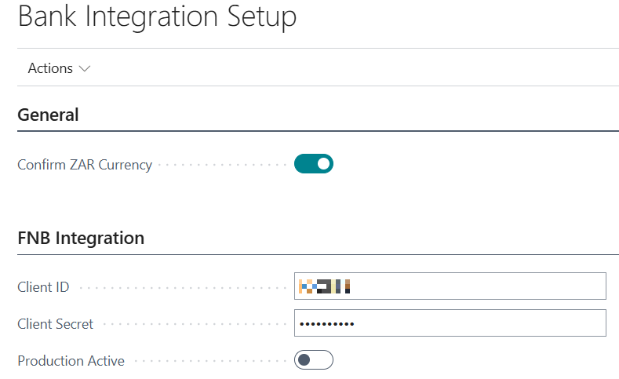
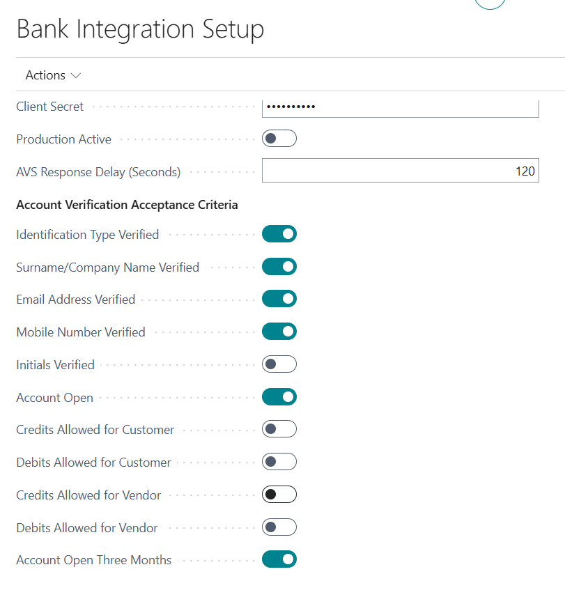
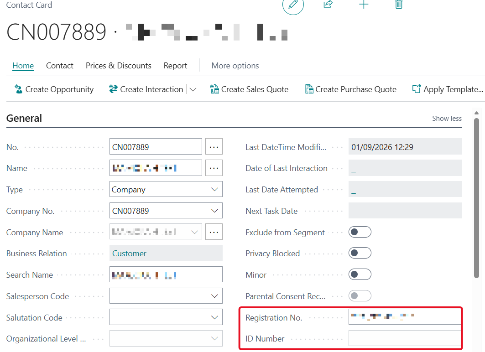
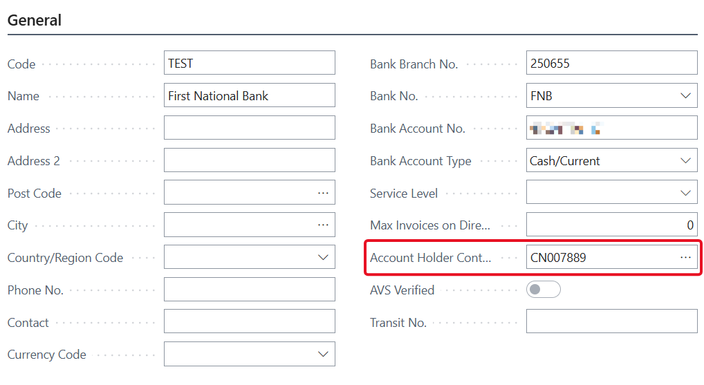
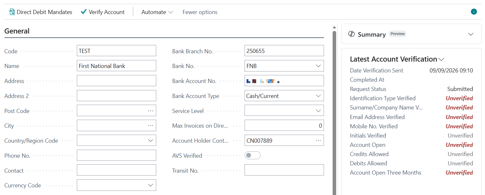
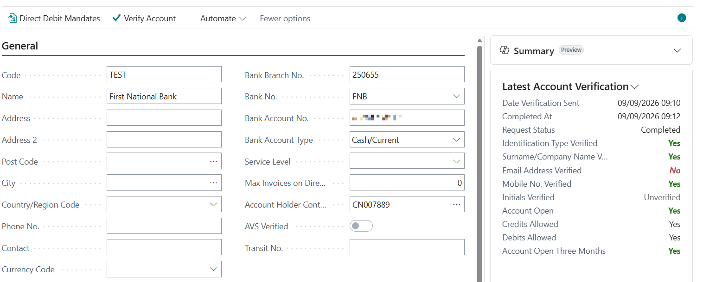
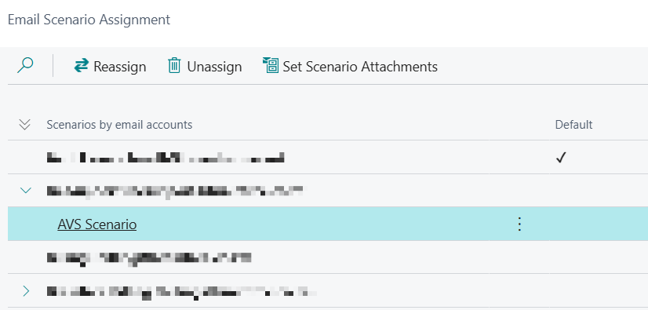

# First National Bank Integration

## Key Features

### Bank Statement Import

- Functionality:
  - File based import of bank statements in the required formats.
  - Supports both standard and short formats for ABSA and Standard Bank.
- Setup
  - On Bank Account Card page, select the Bank Statement Import Format that relates to your bank account.

### Payment Export

- Functionality:
  - Exports payment journal data in bank-specific formats.
- Setup:
  - On Bank Account Card page, select the Payment Export Format that relates to your bank account.

### API Integration for FNB Direct Debit Management

- Automates the creation, processing, and status updates of direct debit collections.
- Supports SEPA-compliant direct debit mandates.
- Only supports direct debit instructions for South African Banks in South African Rand.

### Account Verification Service

- Verifies customer and vendor bank account details through FNB.
- Retrieves results in the background and evaluates them against configurable acceptance criteria.
- See [Account Verification Service setup and usage](#account-verification-service-avs).

## Bank Activation

You need to obtain a Client ID and Client Secret from the bank to use the integration. Contact your company’s bank account manager to obtain these setups and enable your account for the integration.

They will also be able to provide you with Sandbox setups if you want to try it out first.

Add these setups to the Bank Integration Setup page.

If Production Active = No, it will target the bank’s sandbox environment. With Production Active = Yes, it will target bank production environment.

> NOTE: You will not be able to enable it as Production Active in a Sandbox environment.

### Bank Account

| Field | Value | Description |
| --- | --- | --- |
| Bank Branch No. |  | Required |
| Bank Account No. |  | Required |
| Bank Account Type |  | Required |
| SEPA Direct Debit Exp. Format | FNB-DD | During Direct Debit Export, this lets the system know which format to use. The Bank Integration app will then confirm if the selected bank account on the Direct Debit Collection has a Bank Export Format linked and confirm if it is relevant to a specific bank. Each export and their associated checks are therefore only done if appropriate. |
| Direct Debit Msg. Nos. |  | Required |
| Creditor No. |  | This is the company abbreviation used in the export. |
| Service Level |  | Required |
| Batch Booking |  | If Yes, Transactions will be posted to the creditor account in a consolidated manner. A single transaction entry will be posted to the creditor account, for the full value of all transactions. Any transactions that fail will result in a reversal entry being posted on the creditor account. Else, the transactions will be posted to the creditor account in an itemised manner. An entry will be posted into the creditor account for each successful transaction. |
| Auto Post Direct Debit Collection |  | Automatically post the Direct Debit Collection once collections report has been received from the bank and there are no more pending entries. |
| General Journal Template |  | The template to use when automatically posting the direct debit collection |
| General Journal Batch |  | The batch to use when automatically posting the direct debit collection |

### Customer Bank Account

| Field | Value | Description |
| --- | --- | --- |
| Bank Branch No. |  | Required |
| Bank Account No. |  | Required |
| Bank Account Type |  | Required |
| Service Level |  | Required |
| Max Invoices on Direct Debit |  | Indicates the maximum number of invoices that can be loaded on a Direct Debit Collection |
| SWIFT Code |  | Required |

>NOTE: **SEPA Direct Debit Mandates**: No changes have been made to this table, just know that an active mandate is required for this > functionality to work.

## Account Verification Service (AVS)

The Account Verification Service submits customer or vendor bank account details to FNB and retrieves the verification result in the background. The latest result is shown on the bank account card, and all requests remain available on the Account Verification Requests page.

### Prerequisites

Before using AVS:

- Configure the FNB Client ID, Client Secret, and Production Active setting on the Bank Integration Setup page as described in [Bank Activation](#bank-activation).
- Ensure that the Business Central job queue is operational. Each AVS request automatically creates a job queue entry to retrieve its result.
- Configure a Business Central email account for the AVS email scenario if users must receive result notifications.
- Give users the BASIC-BANK BTR and AVS-EDIT BTR permission sets, or the ALL-BANK BTR permission set.

### Configure the Acceptance Criteria

1. Search for and open **Bank Integration Setup**.
2. In the **FNB Integration** section, set **AVS Response Delay (Seconds)**. The minimum and default value is 120 seconds.
3. In **Account Verification Acceptance Criteria**, enable every result that FNB must return as **Yes** before the bank account is considered verified.
4. Enable at least one acceptance criterion. If no criteria are enabled, **AVS Verified** remains disabled even after a completed request.

All enabled criteria must be returned as **Yes** for **AVS Verified** to be enabled. The customer and vendor settings for credits and debits are evaluated according to the type of bank account being verified.

| Acceptance criterion | Applies to |
| --- | --- |
| Identification Type Verified | Customer and vendor bank accounts |
| Surname/Company Name Verified | Customer and vendor bank accounts |
| Email Address Verified | Customer and vendor bank accounts |
| Mobile Number Verified | Customer and vendor bank accounts |
| Initials Verified | Customer and vendor bank accounts |
| Account Open | Customer and vendor bank accounts |
| Credits Allowed for Customer | Customer bank accounts only |
| Debits Allowed for Customer | Customer bank accounts only |
| Credits Allowed for Vendor | Vendor bank accounts only |
| Debits Allowed for Vendor | Vendor bank accounts only |
| Account Open Three Months | Customer and vendor bank accounts |

### Prepare the Account Holder Contact

AVS uses a contact linked to the customer or vendor as the account holder. Create or update the contact before submitting a verification request.

1. Confirm that the contact is related to the customer or vendor through a Contact Business Relation.
2. Enter the contact **Name**.
3. For a person contact, enter the **ID Number** on the Contact Card.
4. For a company contact, enter the **Registration Number**.
5. Enter the email address, mobile number, and initials when those details must be included in the verification or are enabled as acceptance criteria.

The **Account Holder Contact** lookup only allows contacts related to the bank account's customer or vendor.

<!-- TODO: add screenshot -->

### Prepare the Bank Account

On the Customer Bank Account Card or Vendor Bank Account Card, complete these required fields:

| Field | Description |
| --- | --- |
| Bank Account No. | Account number submitted to FNB |
| Bank Branch No. | Branch identifier submitted to FNB |
| Bank Account Type | Account type submitted to FNB |
| Account Holder Contact | Related contact whose identity and contact details are submitted |

### Verify an Account

1. Open the relevant Customer Bank Account Card or Vendor Bank Account Card.
2. Select **Verify Account** from the Processing actions.
3. Confirm that Business Central reports that the request was submitted.
4. Review the **Latest Account Verification** FactBox. The request initially has a status of **Submitted**.
5. Wait for the scheduled job queue entry to retrieve the FNB report. The request changes to **Completed** when a report is processed or **Failed** when retrieval is unsuccessful.
6. The requesting user will receive an email when the verification request is completed.
7. Check **AVS Verified** on the bank account card. It is enabled only when the request is completed and every configured acceptance criterion has a result of **Yes**.

Submitting another verification creates a new request. The FactBox shows the latest request while earlier requests remain in the request history.

### Review Verification Results

The **Latest Account Verification** FactBox shows the request dates, request status, and each verification result. Select **Detail** to open the current request, or search for **Account Verification Requests** to review the complete history.

The verification values are:

| Value | Meaning |
| --- | --- |
| Yes | FNB verified the value |
| No | FNB did not verify the value |
| Unverified | The value was not verified |
| Late Response | FNB returned a delayed response status |
| Error | FNB reported an error for the value |
| Unknown | The returned value could not be interpreted |

On the Account Verification Requests page:

- Select **View Status Reason Information** to review reasons and additional information returned by FNB.
- Select **View Response Content** to view the raw service response for troubleshooting.

### Troubleshooting

- If **Verify Account** reports a missing field, complete all required bank account and contact fields listed above.
- If the Account Holder Contact cannot be selected, confirm that the contact is linked to the same customer or vendor through a Contact Business Relation.
- If a request remains **Submitted**, check the Job Queue Entries page and confirm that the scheduled AVS retrieval entry can run.
- If a request is **Failed**, review **Status Reason Information** and **Response Content**, correct the underlying data or connectivity issue, and submit a new verification request.
- If no result email is received, review the AVS email scenario and email account setup. The result remains available from the bank account FactBox and Account Verification Requests page.

